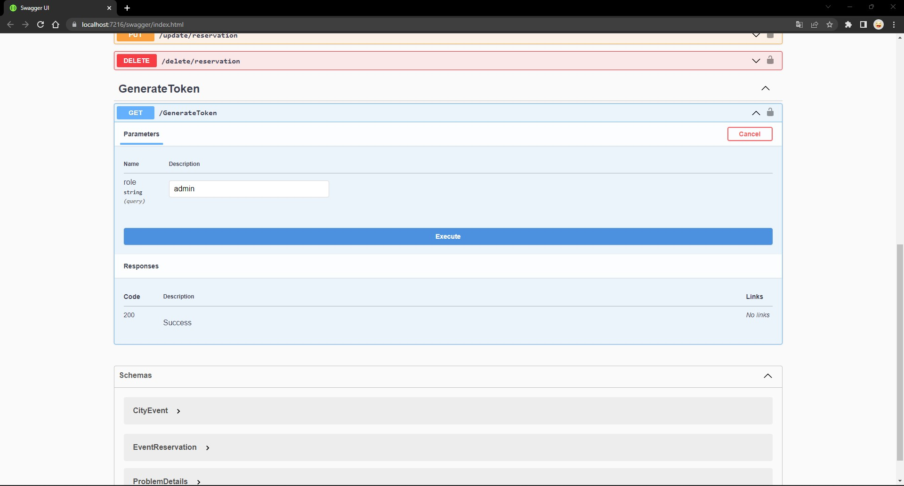
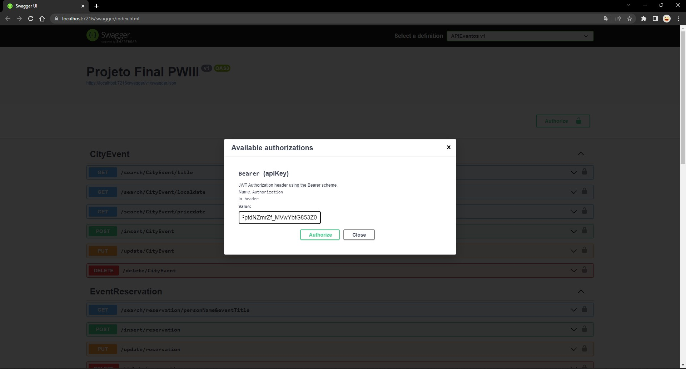

# Projeto Final APIEventos

## SETUP
Para rodar o projeto, crie as tabelas CityEvent e EventReservation com o script abaixo no SqlServer:

```
CREATE TABLE CityEvent(
	[IdEvent] [bigint] IDENTITY(1,1) NOT NULL PRIMARY KEY,
	[Title] [varchar](100) NOT NULL,
	[Description] [text] NULL,
	[DateHourEvent] [datetime] NOT NULL,
	[Local] [varchar](100) NOT NULL,
	[Address] [varchar](300) NULL,
	[Price] [decimal](12, 4) NULL,
	[Status] [bit] NOT NULL,
);

CREATE TABLE EventReservation(
	[IdReservation] [bigint] IDENTITY(1,1) NOT NULL PRIMARY KEY,
	[IdEvent] [bigint] NOT NULL, 
	[PersonName] [varchar](100) NOT NULL,
	[Quantity] [bigint] NOT NULL,
	CONSTRAINT FK_IdEvent FOREIGN KEY (IdEvent) REFERENCES CityEvent(IdEvent),
);
```
Em seguida insira dentro do Projeto de Web API: APIEventos um "App Settings File" contendo o conteúdo abaixo:
```
{
  "Logging": {
    "LogLevel": {
      "Default": "Information",
      "Microsoft.AspNetCore": "Warning"
    }
  },
  "ConnectionStrings": {
    "DefaultConnection": "Server=$ENDERECO_DO_SERVIDOR;Database=$BASE_DE_DADOS; User Id=USER; Password=$SENHA; Encrypt=False"
  },
  
  "AllowedHosts": "*",
  "key": "InsiraAquiUmTokenQueVoceDefinir",
  "Audience": "APIEvents.com",
  "Issuer": "APIClientes.com",
  "local": "https://localhost:7216"
}
```
## EXECUÇÃO
Execute o projeto e no Swagger que irá abrir em seu navegador, gere um "Bearer Token" com a role "admin", copie o conteúdo do Response Body, ele terá a duração de 2 horas.

Gerar Bearer Token
<p style="text-align: center;"><strong></strong></p>
<h2>&nbsp;</h2>

Clique em "Authorize no canto superior direito do Navegador e cole o "Bearer Token" no campo de texto e clique no Botão "Authorize" que consta no pop-up.
Agora você poderá executar todos os métodos disponíveis nas APIs CityEvent e EventReservation disponíveis para o usuário "admin".

Salvar Bearer Token para executar os Testes
<p style="text-align: center;"><strong></strong></p>
<h2>&nbsp;</h2>

Para testar com usuários que não sejam "admin", gere outro Bearer com um nome de role qualquer, e você verá que este usuário terá acesso apenas aos métodos GET de cada API.

## Enunciado
Construa uma API que registre e manipule eventos que acontecem na cidade, como shows, peças de teatro, eventos especiais em restaurantes, entre outros.

Implemente a documentação completa da API, utilizando Swagger. Todos os métodos devem possuir validação dos campos obrigatórios, quais os formatos de dados que a API recebe e responde e quais os possíveis status de retorno.

Construa uma API bem estruturada, respeitando as diretrizes de REST, SOLID e os princípios base de arquitetura.

Trate as exceções que forem necessárias.

Esta API deverá ter um cadastro do evento e um cadastro de reservas. Siga a estrutura apresentada abaixo:
```
CityEvent:
IdEvent               long          incremento PK
Title                 string        not null
Description           string        null
DateHourEvent         DateTime      not null
Local                 string        not null
Address               string        null
Price                 decimal       null
Status                bit           not null

EventReservation:
IdReservation        long        incremento PK
IdEvent              long        not null FK
PersonName           string      not null
Quantity             long        not null
```

Para o CityEvent, construa os métodos:

Inclusão de um novo evento; *Autenticação e Autorização admin
Edição de um evento existente, filtrando por id; *Autenticação e Autorização admin
Remoção de um evento, caso o mesmo não possua reservas em andamento, caso possua inative-o; *Autenticação e Autorização admin
Consulta por título, utilizando similaridades, por exemplo, caso pesquise Show, traga todos os eventos que possuem a palavra Show no título;
Consulta por local e data;
Consulta por range de preço e a data;
Para o EventReservation, construa os métodos:

Inclusão de uma nova reserva; *Autenticação
Edição da quantidade de uma reserva; *Autenticação e Autorização admin
Remoção de uma reserva; *Autenticação e Autorização admin
Consulta de reserva pelo PersonName e Title do evento, utilizando similaridade para o title; *Autenticação
Utilize para autenticação os seguintes parametros:

```
Audience = "APIEvents.com"
Issuer = "APIClientes.com"
key = "InsiraAquiUmTokenQueVoceDefinir"
```
